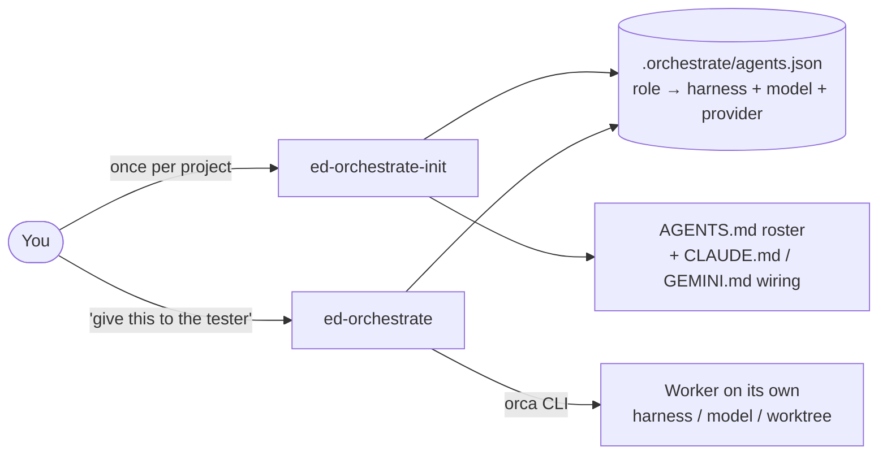
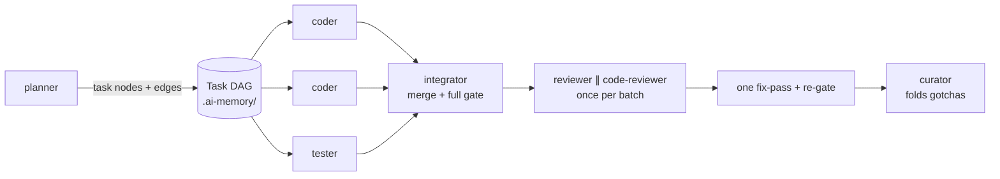
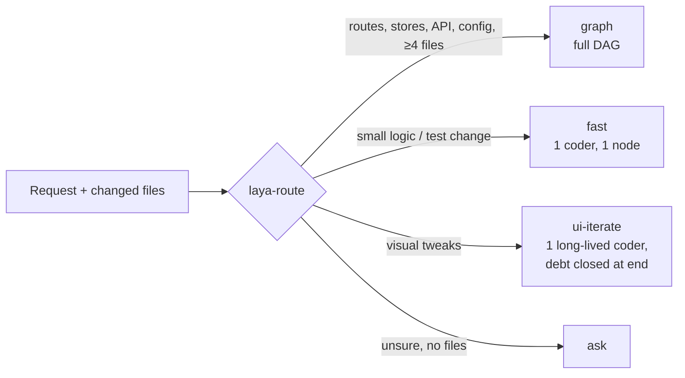

# ed-orchestrate

> 🚀 **A collection of skills to build cost-effective, hybrid multi-AI agent teams effortlessly.**
> 
> Mix and match paid subscriptions & frontier models (Claude, Codex, Gemini) with local open-source models (via OpenCode, Ollama, etc.) to assign specialized sub-agent roles. Combine top-tier reasoning where it matters with cost-efficient local execution for routine tasks—giving you infinite team combinations with maximum performance and minimal cost via Orca orchestration.

A pair of skills (for Claude Code, OpenCode, and Antigravity/AGY) for delegating coding sub-tasks to configurable sub-agent
roles (coder, planner, tester, reviewer, architect, code-reviewer,
designer, qa-designer, curator, integrator, or custom), each pinned to a **harness**
(claude, codex, opencode, agy/antigravity, cursor, gemini, droid), a **model**, and
(for opencode) a **provider**. Delegation itself runs through Orca's `orca-cli` /
`orchestration` skills — worktrees, terminals, supervised worker loops — not a new
mechanism.

- `skills/ed-orchestrate/` — the delegate skill. Given a task and a role, resolves that
  role's harness/model/provider from the target project's
  `.orchestrate/agents.json` and runs the matching `orca` invocation.
- `skills/ed-orchestrate-init/` — the interview skill. Asks the user which roles they
  want and which harness/model/provider each should use, then writes
  `.orchestrate/agents.json` and a generated roster block in the target
  project's `AGENTS.md` (and, for opencode roles, a native
  `.opencode/agent/<role>.md` file).

Both skills also work from opencode and Antigravity/agy via the `AGENTS.md`
auto-load convention those hosts share with Claude Code — see each skill's
`OPENCODE.md` / `AGY.md` overlay.

## How it works

**Why:** models, prices, limits and harnesses change constantly; the *process* shouldn't.
Roles, the task graph, scoped tests and one review per batch stay fixed while each role's
harness/model/provider is swappable. Claude can orchestrate remotely while open-source
models (via opencode) do the volume work, or Claude/any other harness can do everything,
or any mix, with the same quality gates. Orca
launches and supervises the workers; Laya keeps small changes fast.

**1. Set up once, delegate many times.** `ed-orchestrate-init` interviews you and
writes the roster; `ed-orchestrate` reads it on every delegation and starts the right
worker through Orca.



**2. Optional graph mode: plan once, run in parallel, review once per batch.**



**3. Optional Laya router: small changes skip the planner.** A deterministic combiner
merges Laya's yes/no answers with path facts (path facts win, uncertain means `graph`).



More detail — use cases, memory, init flow, graph generation, Laya decision tree, per-skill flows:

- [docs/USE-CASES.md](docs/USE-CASES.md) — why this exists, where Orca fits, mix-and-match scenarios (Claude orchestrates + open-source workers, all-Claude, other harnesses, fallbacks, Laya fast lanes)
- [docs/AI-MEMORY.md](docs/AI-MEMORY.md) — how `.ai-memory/` works, how the worktree symlink shares decisions live, and how Engram complements it
- [docs/ARCHITECTURE.md](docs/ARCHITECTURE.md) — repo-wide diagrams
- [ed-orchestrate flow](skills/ed-orchestrate/references/flow-diagrams.md) — the delegation steps 0–8
- [ed-orchestrate-init flow](skills/ed-orchestrate-init/references/flow-diagrams.md) — interview, fallbacks, generation

## Install

### Quick install (any machine, via [skills.sh](https://www.skills.sh))

```bash
npx skills add edmret/ed-multi-ai --skill ed-orchestrate --skill ed-orchestrate-init -y
```

The `skills` CLI is the package manager for the [skills.sh](https://www.skills.sh)
registry — no account or publishing step needed, it just clones the named
`skills/<name>/SKILL.md` directories out of this public repo. It auto-detects which
coding agents you have installed (Claude Code, opencode, etc.) and installs to each;
pass `-a claude-code` (or `-a opencode`, `-a agy`) to target one explicitly, and `-g`
to install to `~/.claude/skills/` instead of the current project's `.claude/skills/`.
Omit `-y` to review before it writes anything. Re-running is safe — it overwrites the
two skill directories in place, nothing else in your project.

This is the same content as the manual symlink methods below, just fetched over the
network instead of pointed at a local clone — pick whichever fits: symlinks if you're
actively developing this repo and want edits to apply instantly everywhere it's
linked, `npx skills add` if you just want it installed on a machine that doesn't have
this repo cloned.

The `owner/repo` shorthand always fetches the repo's **default branch**. Until this
repo's changes land on `main`, install from this branch explicitly with a full
GitHub tree URL instead:

```bash
npx skills add https://github.com/edmret/ed-multi-ai/tree/extend-roles/skills/ed-orchestrate -y
npx skills add https://github.com/edmret/ed-multi-ai/tree/extend-roles/skills/ed-orchestrate-init -y
```

Works the same for a private repo — the CLI reuses whatever git credentials
(credential helper, `gh`, SSH, or `GITHUB_TOKEN`/`GH_TOKEN`) are already configured
for `github.com`.

### Manual: For Antigravity / AGY CLI & Universal Skills (`~/.agents/skills`)

Antigravity discovers global skills from `~/.gemini/config/skills/`. Link Antigravity's config to `~/.agents/skills/` and symlink the repo skills:

```bash
# 1. Ensure Antigravity's global skills directory points to ~/.agents/skills
mkdir -p ~/.agents/skills
ln -s ~/.agents/skills ~/.gemini/config/skills

# 2. Symlink ed-orchestrate skills
ln -s /path/to/ed-orchestation/skills/ed-orchestrate      ~/.agents/skills/ed-orchestrate
ln -s /path/to/ed-orchestation/skills/ed-orchestrate-init ~/.agents/skills/ed-orchestrate-init
```

### Manual: For Claude Code

```bash
mkdir -p ~/.claude/skills
ln -s /path/to/ed-orchestation/skills/ed-orchestrate      ~/.claude/skills/ed-orchestrate
ln -s /path/to/ed-orchestation/skills/ed-orchestrate-init ~/.claude/skills/ed-orchestrate-init
```

`ed-orchestrate-init` requires `ed-orchestrate` installed alongside it — it reuses
`skills/ed-orchestrate/scripts/validate_agents_json.py` as the canonical config validator.
This holds for either install method: `npx skills add` and the manual symlinks both
put the two directories side by side.

## Usage

In a project you want to delegate work in, run `ed-orchestrate-init` once to build
a roster, then say things like "hand off writing tests to the tester role" or
"supervise the coder on implementing X" — see `skills/ed-orchestrate/AGENTS.md` for the
full flow.

## Optional: graph-engineered delegation, not a flat loop

For a multi-step feature spanning several roles (possibly parallel work),
`ed-orchestrate-init` can also wire up a Directed Acyclic Graph of task nodes instead
of a flat "delegate one task, then the next" loop: `planner` emits task-node
markdown files into a shared directory (default `.ai-memory/`), the orchestrator
dispatches every `ready` node rather than a fixed sequence, and each batch ends in
ONE integration node — `integrator` merges and runs the full suite + e2e once, then
`reviewer` ∥ `code-reviewer` review the combined batch diff once (not per task),
followed by one fix-pass and a re-gate. Coders and testers run only unit tests
scoped to their own files. `curator` periodically folds finished task reports into
per-area gotcha files. See `skills/ed-orchestrate/references/graph-dag.md`.

Init scaffolds every template this needs — task node, batch-integration node,
UI-iteration ledger, plan, ADR, review, a gotchas index with seed `00-core.md` /
`harness.md` (cross-harness traps already hit in earlier projects), and patterns —
gitignores the directory and registers it as an Orca-worktree-shared directory in
`orca.yaml`. It's off by default; re-running init on a wired project refreshes the
AGENTS.md block and adds newer templates without touching existing files.

### Engram: durable memory for the orchestrator

With graph mode on, init can also add an orchestrator-only **Engram** section to the
AGENTS.md block (Recommended when Engram is detected on the machine): the orchestrator
`mem_search`es before planning, `mem_save`s accepted ADRs / batch root causes /
preferences as pointers into `.ai-memory/`, and writes a `mem_session_summary` at the
end. Workers never depend on it, so it works on any harness mix. See
`skills/ed-orchestrate/references/engram-memory.md`.

### Laya router: small changes skip the planner

With graph mode on, init can also install `.orchestrate/bin/laya-route`, a
stdlib-only router every harness can call. It asks a local Laya server atomic
yes/no questions, combines them deterministically with path facts (path facts
always win; Laya down → path facts alone), and picks a lane: `graph` (the full
DAG), `fast` (one coder, one task node), `ui-iterate` (one long-lived coder for a
run of visual tweaks, skipped tests/e2e logged as debt and closed at the end by a
planner-built debt-closure batch), or `ask`. Decisions and outcomes are logged as a
fine-tuning dataset. See `skills/ed-orchestrate/references/laya-routing.md`.

## Always on: every harness actually reads the setup, and can write

Three things init fixes without asking, because each silently breaks delegation
on a new project:

- **Claude Code** only auto-loads `AGENTS.md` when there's no `CLAUDE.md` — init
  splices an `@AGENTS.md` import into `CLAUDE.md`.
- **gemini-cli / agy** read only `GEMINI.md` — init adds `AGENTS.md` to
  `.gemini/settings.json`'s `context.fileName` and makes `.gemini/GEMINI.md` a thin
  pointer (orchestrator guard + agy headless notes) instead of a drifting copy.
- **Worker writes** — opencode rejects writes through the worktree-shared symlinks
  unless `opencode.json` allows `external_directory` (init sets it); headless agy
  denies all file I/O without `--dangerously-skip-permissions` (init proposes it as
  the role's `cliFlags`, the validator warns when missing) and needs per-project
  read/write entries in its user-global settings (init offers to add them for the
  repo and its Orca worktree dir).

## Optional: enforce "orchestrator doesn't self-code" at the permission layer

Every role in the roster has a documented forbidden zone (`reviewer` never edits,
`coder` never touches out-of-scope files, etc.), and the orchestrator itself is
supposed to delegate implementation work rather than write it. That boundary is
prompt convention by default. `ed-orchestrate-init` can also add a
`.claude/settings.json` `permissions.deny` rule (e.g. `Edit(src/**)`,
`Write(src/**)`) so the orchestrator's own session is denied those writes at the
tool layer, not just by instruction — see
`skills/ed-orchestrate/references/no-self-code.md`. Also opt-in, asked once on a
fresh init. If a writing role runs on Claude Code, init puts the rule in
`.claude/settings.local.json` instead — the tracked `settings.json` is checked out
into every worktree and would block that worker too.
