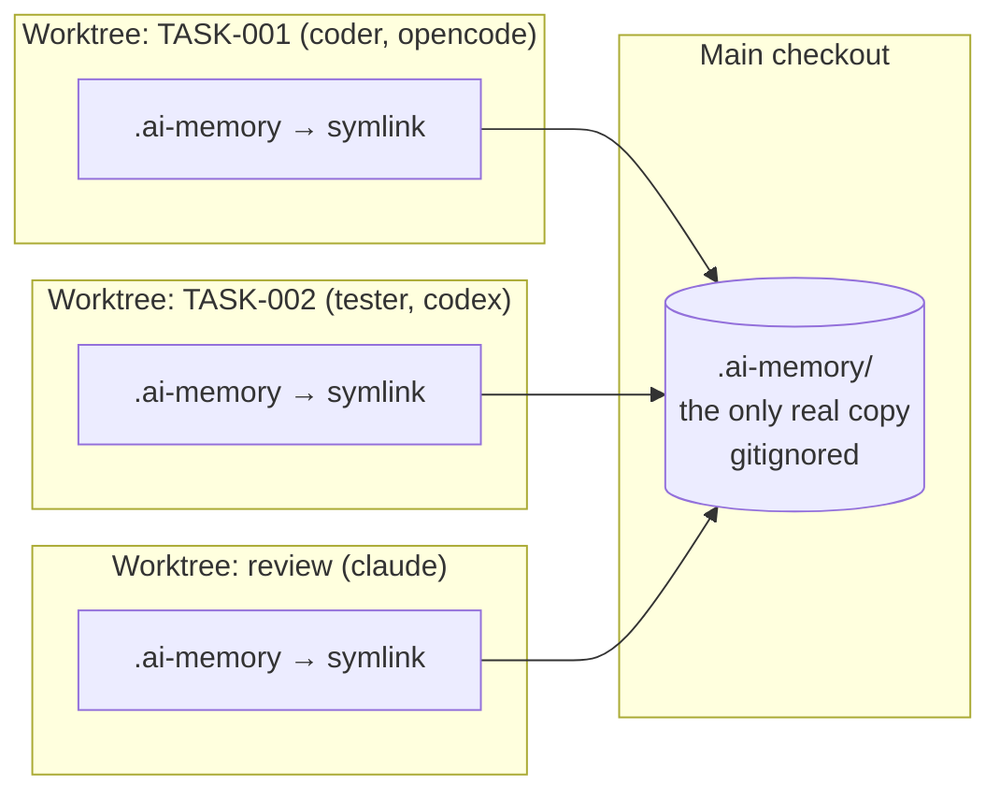
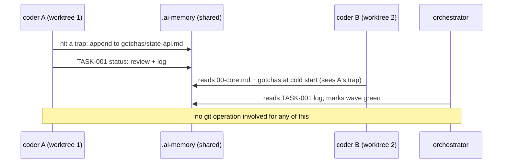
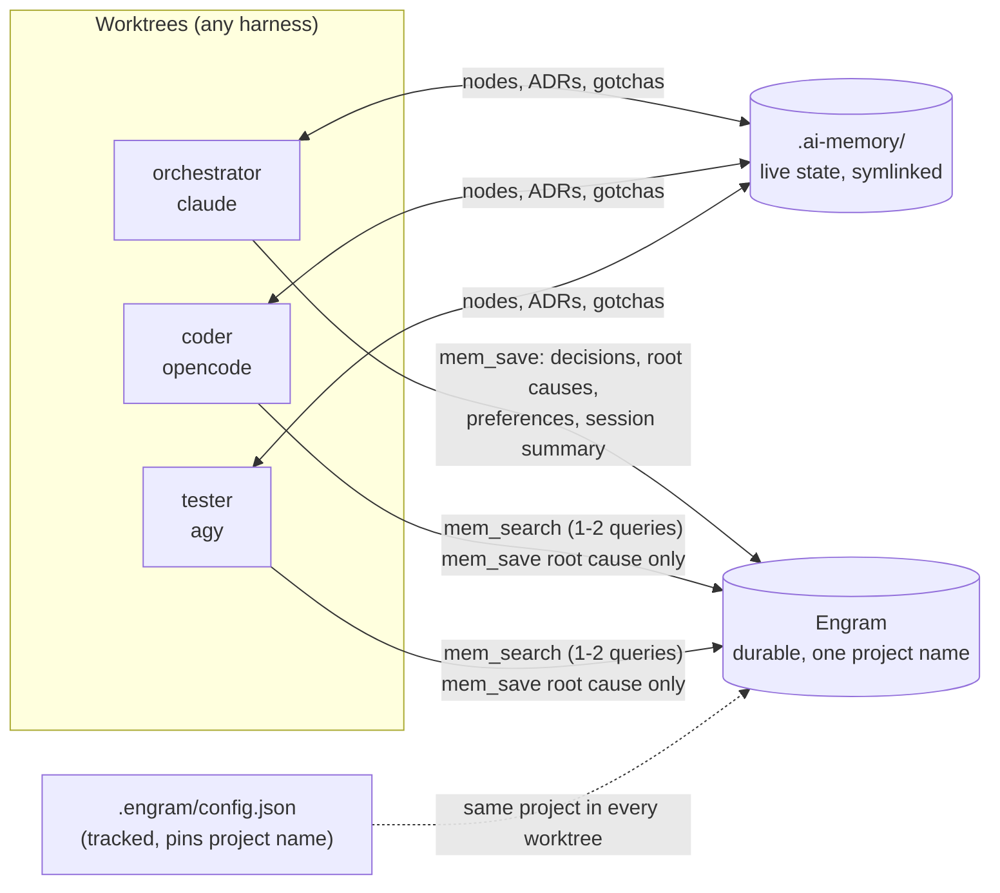

# The shared memory directory (`.ai-memory/`)

`.ai-memory/` is the default name (init asks; any path works) of the project's **shared
task memory**: the task graph, decisions, reviews and accumulated gotchas that every
role reads and writes. It's what lets agents on different models and harnesses,
in different worktrees, work on one plan without a human relaying context.

## What's inside

```
.ai-memory/
├── INDEX.md              map of content, entry point for planner / architect / curator
├── plans/PLAN-n.md       the DAG's table of contents: goal, tasks in order, risks
├── tasks/
│   ├── TASK-xxx.md       one node: frontmatter edges + Execution & Diffs Log
│   ├── TASK-…-batch-integration.md   the once-per-batch merge, gate, review node
│   └── ITER-xxx.md       UI-iteration ledger (debt list) for the ui-iterate lane
├── adrs/ADR-n.md         decisions ("why this approach"), linked from nodes via governed_by
├── reviews/REVIEW-n.md   reviewer / code-reviewer findings, one per batch
├── knowledge/
│   ├── gotchas.md        area index
│   ├── gotchas/00-core.md, harness.md, <area>.md   traps hit before, newest first
│   └── patterns.md       settled canonical approaches
└── laya/decisions.jsonl  Laya router decisions + outcomes
```

Who touches what:

| Role | Reads | Writes |
| --- | --- | --- |
| planner | INDEX, ADRs, gotchas | PLAN, TASK nodes |
| coder / tester | own node, its ADRs, `00-core.md`, only the node's `context:` files | own node's log, new gotchas |
| integrator | batch-integration node | its log, Laya outcome |
| reviewer / code-reviewer | combined batch diff | REVIEW |
| curator | finished reports | area gotchas, prunes `00-core.md` (≤ 8 KB) |
| orchestrator | INDEX, nodes | node status, ITER close-out |

Workers get a **pointer** ("Execute TASK-012. Governed by ADR-003.") and pull their own
context from here, instead of the orchestrator re-explaining the feature every dispatch.

## The problem: decisions vs. worktrees

Parallel agents each work in their own **git worktree** so they can't clobber each
other's files. But that isolation is exactly what breaks shared knowledge:

- A tracked memory directory is *per branch*. An ADR written in worktree A doesn't exist
  in worktree B until someone commits, and B pulls or merges it.
- Task-node status, a fresh gotcha, a new decision would need a commit/merge cycle
  between agents mid-batch, and workers are forbidden from running git.
- Committing them also pollutes feature branches and produces merge conflicts in
  files that are pure coordination scratch.

## The solution: one real directory, symlinked into every worktree



Init wires this in three places (`setup_graph_dag.py`):

1. **`orca.yaml` → `worktree.sharedDirectories`**: Orca creates the symlink in every
   worktree it makes, so all agents see the *same live files*.
2. **`.gitignore`** entry with **no trailing slash**: in a worktree the directory is a
   symlink, and a `dir/` pattern doesn't match a symlink, so git would show it as
   untracked. This is coordination scratch, never committed.
3. **AGENTS.md graph-DAG block**: tells every role where the graph lives and how to use it.

Result: an ADR, a status flip or a gotcha written by any worker is immediately visible
to every other worker and to the orchestrator: no commit, no pull, no relay. Code
still flows through git normally (worker branches merged by `integrator`); only the
*coordination state* is shared live.



## Gotchas of the symlink design

- **Pre-flight**: every worker's rules (AGENTS.md block) start with a check: in a linked
  worktree, `readlink .ai-memory` must resolve into the main checkout. If it's missing or
  a real directory the worker STOPS and reports. A locally created copy would be silently
  discarded with the worktree, losing every task-node update.

- **opencode**: the symlink resolves *outside* the worktree, so opencode treats it as
  `external_directory` and, in `run` mode, silently rejects reads/writes. Init sets
  `permission.external_directory: "allow"` in `opencode.json`.
- **agy headless**: needs `--dangerously-skip-permissions` plus per-project
  read/write entries for the repo and the worktrees dir (init offers both).
- **Shared means shared state**: a killed worker's stale `status: review` in a node is the
  first thing the next dispatch reads. After abandoning a worker, purge that node's log
  (resetting only the worktree is half a rollback).
- **Local to one machine**: the directory is gitignored, so it doesn't travel to
  teammates or another computer. If a decision must outlive the local checkout (or be
  visible to people not running this setup), promote it by hand into tracked docs.
  *This promotion step is a suggestion; the skills don't automate it.*

## Engram: durable memory for the whole team (optional)

`.ai-memory/` is live, project-local state. **Engram** adds long-term memory across
sessions and projects, and lets any agent `mem_search` a topic instead of re-reading
files (fewer tokens). Init offers it at step 5g, adds Engram rules for the orchestrator
**and** workers to the graph-DAG block, checks every harness in the roster has Engram,
and pins one project name for all worktrees. Details, per-harness install commands and
detection: [engram-memory.md](../skills/ed-orchestrate/references/engram-memory.md).

| | `.ai-memory/` | Engram |
| --- | --- | --- |
| Scope | one project's task graph and knowledge | across sessions and projects, per user |
| Holds | state: nodes, logs, reviews, gotchas | distilled decisions, root causes, preferences, session summaries |
| Shared via | filesystem symlink | MCP server, configured per harness (user-global) |



If a harness has no Engram, its workers skip it and use `.ai-memory/` alone; init tells
you which harnesses are missing and the `engram setup <agent>` command for each.
