# Architecture & diagrams

Visual guide to how `ed-orchestrate` / `ed-orchestrate-init` fit together, how the
task graph gets generated, and how the Laya router picks a lane. Text references
these diagrams summarize:
[graph-dag.md](../skills/ed-orchestrate/references/graph-dag.md),
[laya-routing.md](../skills/ed-orchestrate/references/laya-routing.md).

Contents

1. [Big picture](#1-big-picture)
2. [What `ed-orchestrate-init` generates](#2-what-ed-orchestrate-init-generates)
3. [How the graph is generated and walked](#3-how-the-graph-is-generated-and-walked)
4. [Task node lifecycle](#4-task-node-lifecycle)
5. [How Laya works](#5-how-laya-works)
6. [Lanes end to end](#6-lanes-end-to-end)
7. [The router learns: decision + outcome log](#7-the-router-learns-decision--outcome-log)
8. [Single delegation (`ed-orchestrate`)](#8-single-delegation-ed-orchestrate)

---

## 1. Big picture

Two skills, one config file. `init` writes it once; `ed-orchestrate` reads it on every
delegation. The graph and Laya are optional layers on top.

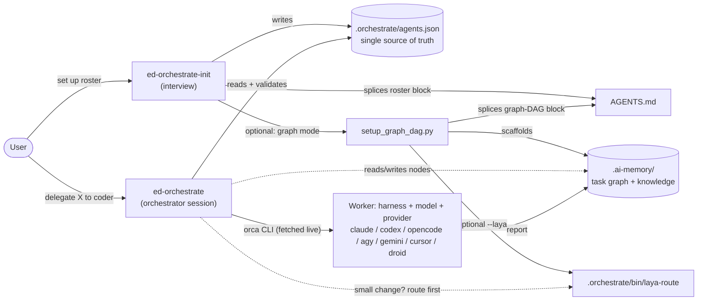

## 2. What `ed-orchestrate-init` generates

Step 5 of the init flow. Steps marked **always** run without asking because each one
fixes a silent failure on a fresh project.

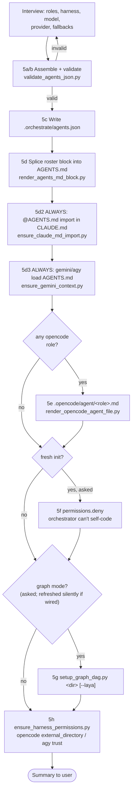

Why the always-on steps exist:

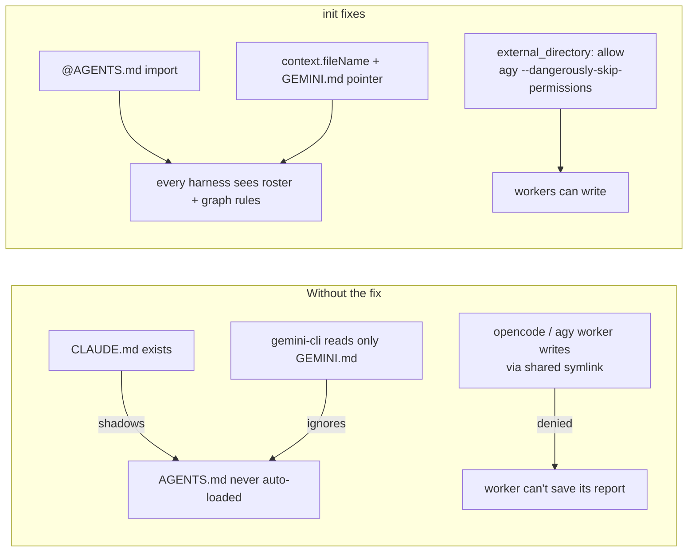

## 3. How the graph is generated and walked

### 3a. Generation: `setup_graph_dag.py <dir>`

Idempotent. Templates are only ever created, never overwritten. The AGENTS.md block is
regenerated on every re-run.

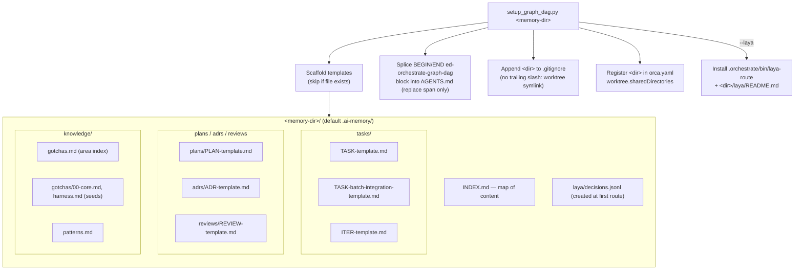

### 3b. Walking: one batch

`planner` builds the DAG once; the orchestrator walks it. Review happens once per
batch, not per task.

```mermaid
sequenceDiagram
    autonumber
    actor U as User
    participant O as Orchestrator
    participant P as planner
    participant C as coder / tester (parallel worktrees)
    participant I as integrator
    participant R as reviewer ∥ code-reviewer
    participant K as curator
    participant M as .ai-memory

    U->>O: feature request
    O->>P: "Plan goal G" (pointer, not full context)
    P->>M: PLAN-n.md + TASK-*.md (frontmatter edges) + batch-integration node
    loop every ready node (depends_on all done)
        O->>C: "Execute TASK-x. Governed by ADR-y."
        C->>M: read node + 00-core.md + node.context only
        C->>C: scoped unit tests only (no e2e, no full suite, no git)
        C->>M: Execution log, status -> review
        O->>O: branch + commit green wave (rollback point)
    end
    O->>I: batch-integration node
    I->>I: merge branches, typecheck+build, lint, full unit, e2e
    O->>R: review combined batch diff ONCE
    R->>M: REVIEW-n.md
    O->>O: triage: accept -> 1 coder fix-pass, or waive with reason
    O->>I: re-gate
    I->>M: nodes -> done, Laya outcome recorded
    O->>K: periodic hygiene pass
    K->>M: fold gotchas into knowledge/gotchas/&lt;area&gt;.md
```

Only nodes the planner flags `review: early` (auth, shared state, public API, DI
tokens, cross-cutting infra) get an isolated review before dependents build on them.

## 4. Task node lifecycle

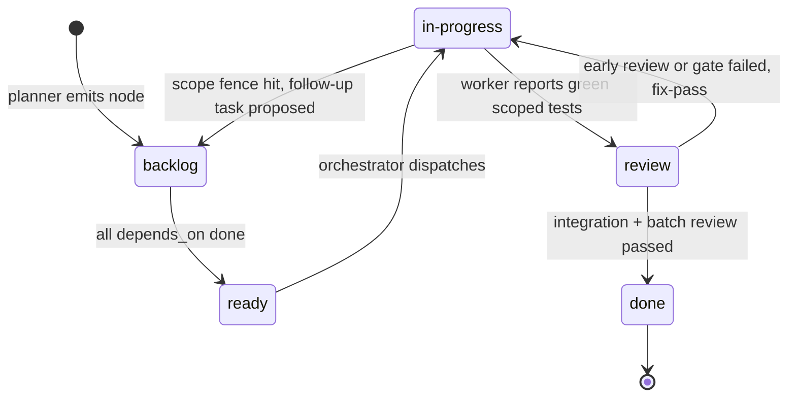

Edges live in each node's YAML frontmatter:

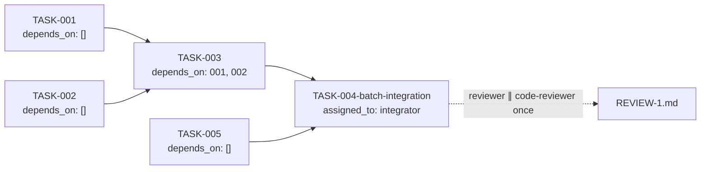

## 5. How Laya works

`laya-route` is a stdlib-only script every harness can call from a shell. It fuses two
signals: **Laya** (a local model server answering atomic yes/no questions) and **path
facts** (regex over changed files). A deterministic combiner picks the lane — no LLM
makes the final call.

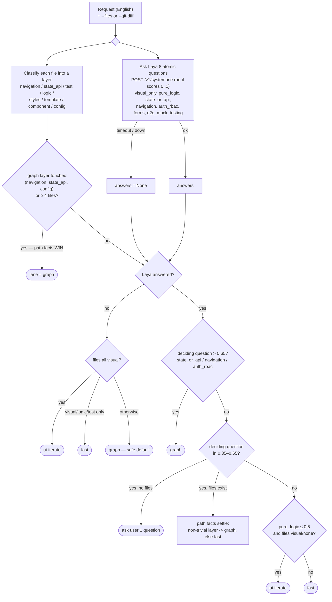

Output of every call, and how it feeds dispatch:

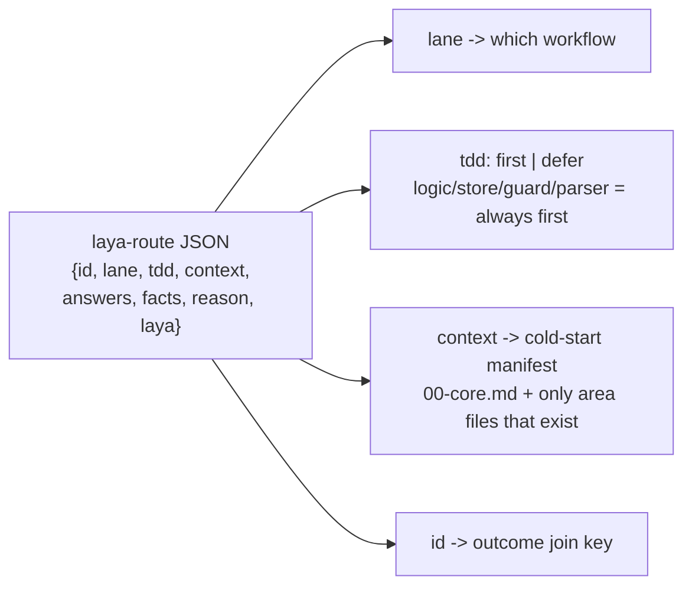

Design rules baked in (measured, see `laya-routing.md`):

- **Atomic questions only.** Single-aspect questions scored 9–10/10; one broad "fast or
  graph?" question scored 6–7/10 and every miss was unsafe (graph → fast).
- **Path facts override Laya.** Laya timed out on 5 of 13 early requests; path facts
  routed all 5 correctly. Always pass `--files` / `--git-diff` when known.
- **Uncertain means `graph`.** Failure mode is "too careful", never "too loose".
- **Lane + files pick context; Laya scores pick only the lane.** Stops a high
  state/API score on a UI tweak from dragging in graph-wide context.

## 6. Lanes end to end

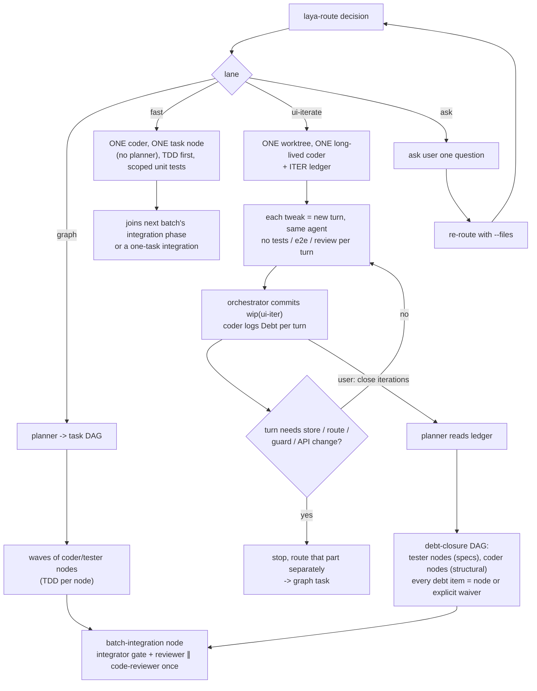

| Lane | Cost | Guarantees |
| --- | --- | --- |
| `graph` | highest | full DAG, one batch integration + review |
| `fast` | low | TDD first, still ends in an integration phase |
| `ui-iterate` | lowest per turn | skipped work is logged as debt and *must* be closed at the end |
| `ask` | one question | re-routed with file facts |

## 7. The router learns: decision + outcome log

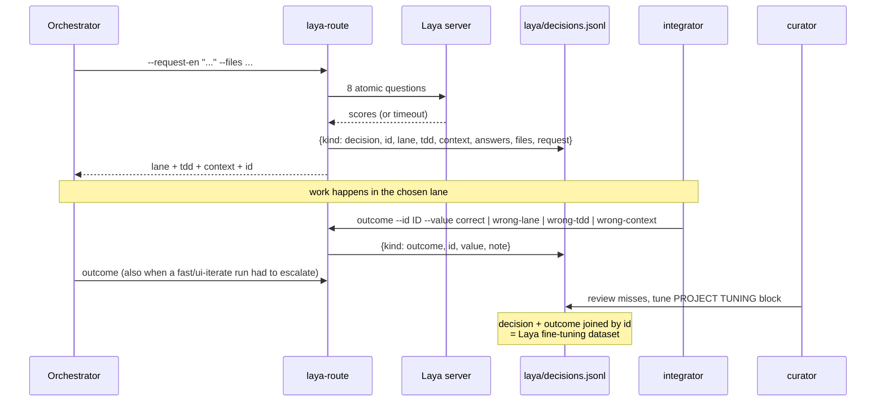

Tuning knobs live in the `PROJECT TUNING` block of the installed
`.orchestrate/bin/laya-route` (the project owns that copy; init never overwrites it):
`LAYER_RULES`, `GRAPH_LAYERS`, `QUESTIONS` / `DECIDING`, `TOPIC_CONTEXT` /
`LAYER_CONTEXT`.

## 8. Single delegation (`ed-orchestrate`)

What happens for one "give this to the tester" request, with or without the graph.

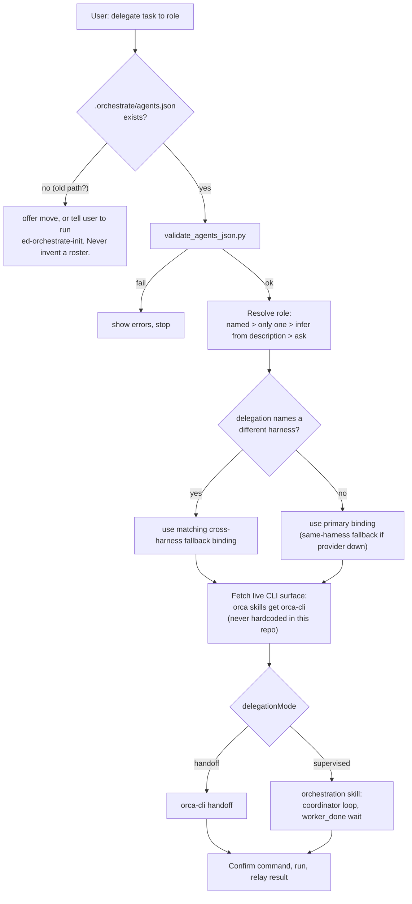

Model selection differs per harness — see
[harness-model-support.md](../skills/ed-orchestrate/references/harness-model-support.md):
`--model`/`--effort` thread through for `claude`, `codex`, `cursor`; `opencode`, `agy`,
`gemini`, `droid` use per-harness reference files or a generated agent file.
