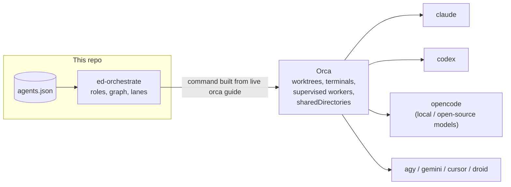
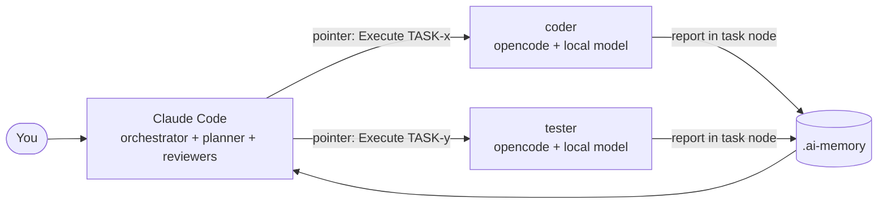
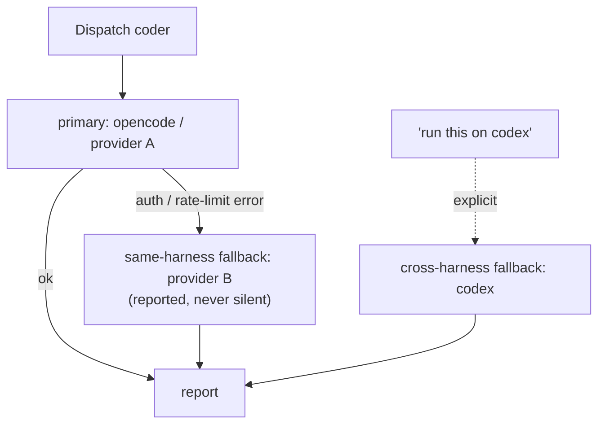
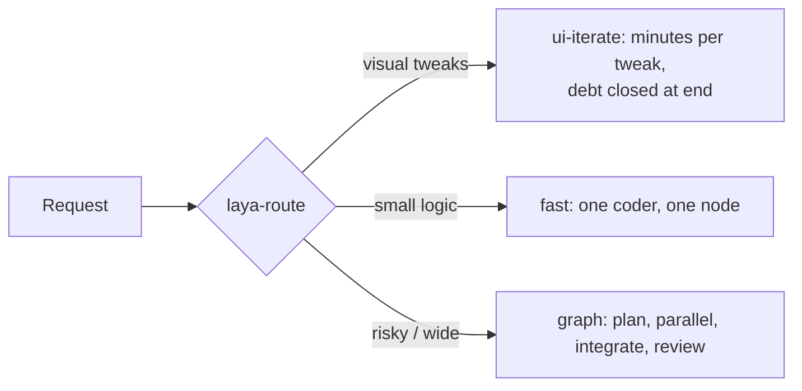

# Use cases & why this exists

## The problem

Model quality, price, rate limits and tooling change every month, and every harness
(Claude Code, Codex, opencode, Antigravity/agy, Gemini CLI, Cursor, Droid) has its own
strengths. Locking a project's workflow to one of them means the *process* breaks when
you swap the model, hit a limit, or want a cheaper option for routine work.

`ed-orchestrate` separates the two concerns:

- **The methodology stays fixed**: roles, a task graph, scoped verification, one
  integration gate and one review per batch, a shared memory of decisions and gotchas.
- **The binding is swappable**: each role is pinned to a `harness + model + provider`
  in `.orchestrate/agents.json`. Change the binding, the process and the quality gates
  stay the same.

So software keeps shipping with the same quality bar no matter which model, provider or
harness does a given piece of work, and they can be mixed freely.

## Where Orca fits

Orca (the `orca` CLI) is the **execution layer**.
This repo doesn't spawn agents itself: it decides *who* does *what* (roster, roles,
graph, lanes) and then hands the actual launching to `orca`:

| Concern | Owner |
| --- | --- |
| Which role / harness / model / provider, fallbacks | `agents.json` (this repo) |
| Task graph, lanes, review policy, memory layout | `ed-orchestrate*` skills (this repo) |
| Creating worktrees, launching harness terminals, supervised worker loops, sharing directories into worktrees | **Orca** (`orca-cli`, `orchestration`, `orca.yaml`) |

The `orca` CLI surface is always fetched live (`orca skills get orca-cli`) so these
skills never drift from the installed binary.

## Use cases

### 1. Claude orchestrates, cheap or open-source models do the work

Orchestrator session = Claude Code (the strongest reasoning, talking to you). It never
writes application code; it plans, routes, dispatches and triages. Coders and testers
run on `opencode` with a local or open-source model (Ollama, etc.).

Typical roster: `planner`, `reviewer`, `code-reviewer`, `architect` on Claude (judgment
where it matters); `coder`, `tester`, `integrator` on opencode. Routine volume runs on
near-zero-cost tokens; the expensive model spends its tokens on planning and review.

### 2. Claude for everything

Set every role to `claude` (different `model`/`effort` per role: e.g. a cheaper model for
`coder`, the top model for `reviewer`). You still get the graph, scoped tests,
once-per-batch review and Laya fast lanes. Note: a `claude` worker inherits git-tracked
`.claude/settings.json`, which is why init writes the no-self-code deny rule to
`settings.local.json` in that case (see [no-self-code.md](../skills/ed-orchestrate/references/no-self-code.md)).

### 3. Everything on another harness

Orchestrate from opencode or Antigravity/agy instead of Claude Code: both read the same
`AGENTS.md` roster and graph block, and each skill has an `OPENCODE.md` / `AGY.md`
overlay for the few host differences. Same methodology, different front door.

### 4. Provider outage or rate limit mid-batch

Give a role `fallbacks`:

- **same-harness** (no `harness` key): retried automatically with another provider/model
  when the primary fails for a provider reason (`AGENTS.md` step 2b).
- **cross-harness** (explicit `harness`): used when you say "run this on codex".

### 5. Model comparison / swap without changing process

Same task graph, different binding for `coder`: run a batch on model A, the next on
model B, compare the review findings and gate results. Because reviewers and the
integration gate are role-fixed, the *evaluation* is consistent across models.

### 6. Fast iteration on small changes (Laya)

"Make the totals bar sticky" doesn't need a planner, a task DAG and two reviewers.
`laya-route` picks the lightest safe lane: `fast` (one coder, one node) or `ui-iterate`
(one long-lived coder; each tweak is a turn to the same warm agent, skipped tests logged
as debt and closed by a debt-closure batch at the end). Anything touching routes, stores,
API, config or 4+ files goes to the full `graph`. Decisions and outcomes are logged, so
the router improves. See [ARCHITECTURE.md §5–7](ARCHITECTURE.md#5-how-laya-works).

### 7. Parallel feature work with one review

`planner` splits a feature into nodes; independent nodes run in parallel worktrees on
different harnesses; `integrator` merges and runs the full gate once; reviewers look at
the combined diff once. See [ARCHITECTURE.md §3](ARCHITECTURE.md#3-how-the-graph-is-generated-and-walked).

## Why quality holds across models

| Mechanism | Effect |
| --- | --- |
| Roles with fixed forbidden zones (`reviewer` never edits, orchestrator never codes) | Judgment and implementation stay separated whichever model fills the role |
| Task nodes with scope fence, `context:` manifest, cold-start budget | A weak model can't wander; a strong model isn't drowned in context |
| Scoped unit tests per node, full gate once per batch by `integrator` | Green self-graded tests never count as review |
| Review by a different role (often a different model) than the author | Independent second opinion |
| Shared gotchas and ADRs in [`.ai-memory`](AI-MEMORY.md) | Lessons learned by one model/harness reach all others |
| Ground-truth checks (files changed, node log), not exit codes | Works the same for every harness |
