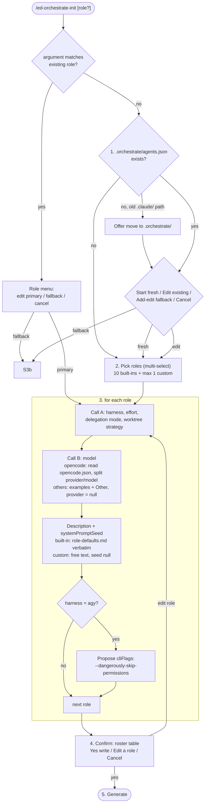
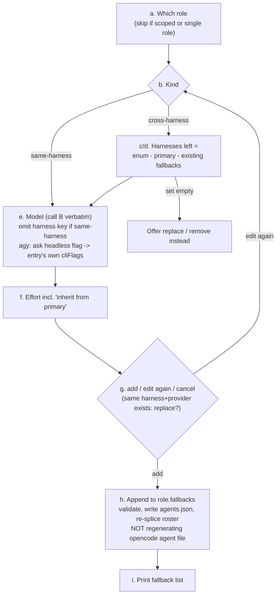
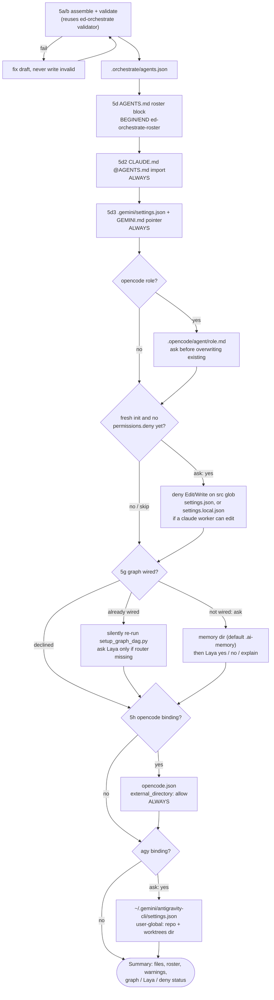
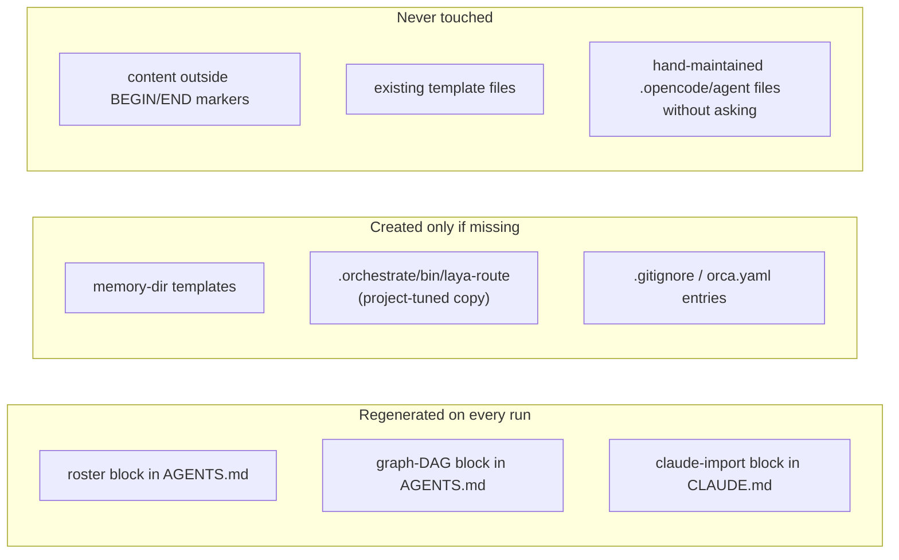

# ed-orchestrate-init — flow diagrams

Visual companion to [../AGENTS.md](../AGENTS.md). Step numbers match that file; if the
procedure changes there, update these. Repo-wide diagrams (graph, Laya):
[docs/ARCHITECTURE.md](../../../docs/ARCHITECTURE.md).

## Interview (steps 1–4)

## Fallback sub-flow (step 3b)

## Generate (step 5) with artifacts

## Idempotency: what re-runs may touch

