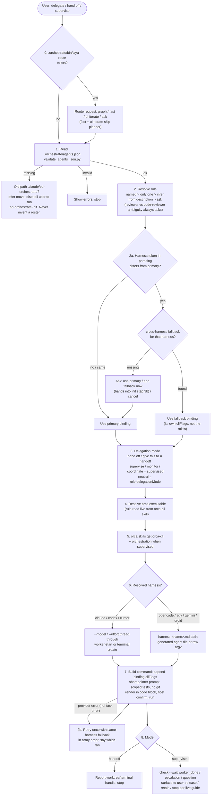
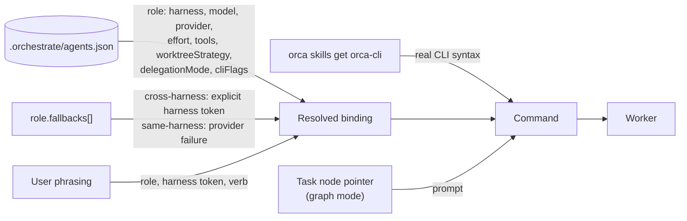
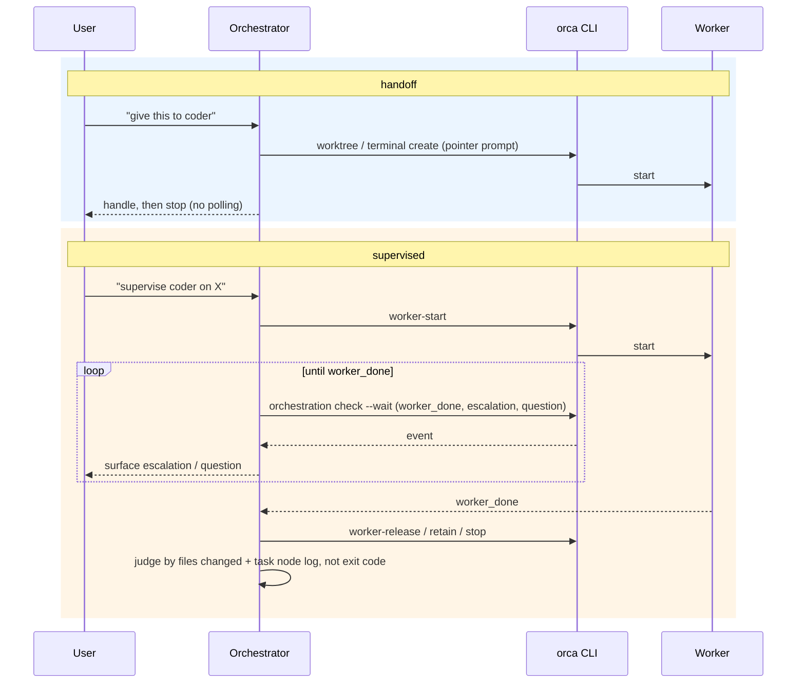

# ed-orchestrate — flow diagrams

Visual companion to [../AGENTS.md](../AGENTS.md). Step numbers match that file; if the
procedure changes there, update these. Repo-wide diagrams (graph, Laya):
[docs/ARCHITECTURE.md](../../../docs/ARCHITECTURE.md).

## Full delegation flow (steps 0–8)

## Where one delegation's inputs come from

## Handoff vs supervised

